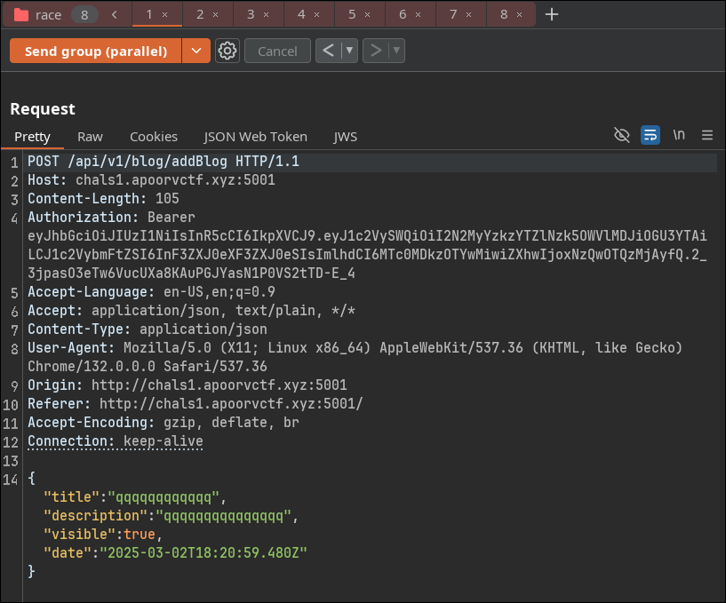

### Recon
The challenge provides the following API endpoints:
```
/api/register
/api/login
/api/dashboard
/api/v1/blog/getAll
/api/v2/gift
/api/v1/blog/addBlog
```

Users can add only one blog per day,and if a user has more than 5 blogs, they can claim a gift at **/api/v2/gift**.
### Exploit race condition 

Since there’s no proper lock mechanism, we can send multiple concurrent requests to `/api/v1/blog/addBlog` before the server updates the blog count.

I can either use a Python script with `threading` or use the [build-in single packet attack](https://portswigger.net/burp/documentation/desktop/tools/repeater/send-group#sending-requests-in-parallel) of Burp Suite



Then visit `/api/v1/gift` to get the flag